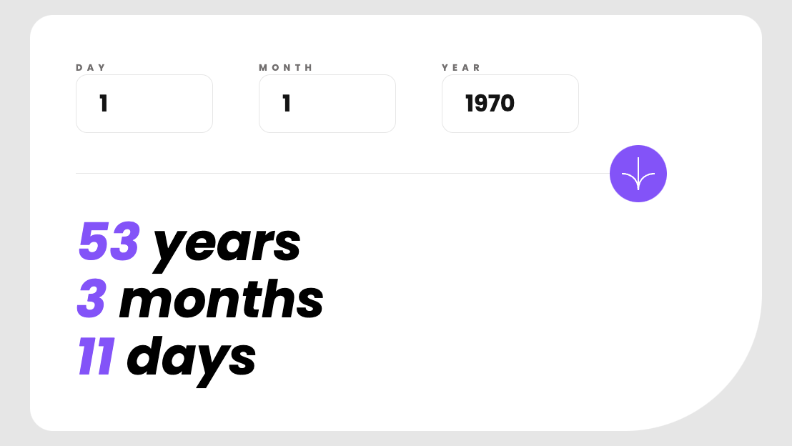

# Frontend Mentor - Age calculator app solution

This is a solution to the [Age calculator app challenge on Frontend Mentor](https://www.frontendmentor.io/challenges/age-calculator-app-dF9DFFpj-Q). Frontend Mentor challenges help you improve your coding skills by building realistic projects.

## Screenshot

## Links

- [Live Site](https://fem-age-calculator.vercel.app/)

## Built with

- [React](https://reactjs.org/)
- [Next.js](https://nextjs.org/)
- [Tailwindcss](https://tailwindcss.com/)
